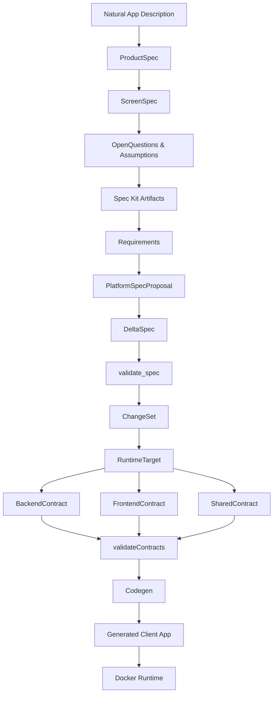

# 00 — Global Flow

Complete pipeline from Natural App Description to Docker Runtime.

This diagram covers all 10 layers of the DTFS execution flow, from free-text input to a containerised running application.

## Concepts liés

- [[EXECUTION_FLOW]] — walk-through détaillé de chaque couche
- [[RUNTIME_CONTRACTS_OVERVIEW]] — couche contracts
- [[CHANGESET_FLOW]] — lifecycle ChangeSet
- [[00-global-architecture]] — schéma Excalidraw

> Status: stable
