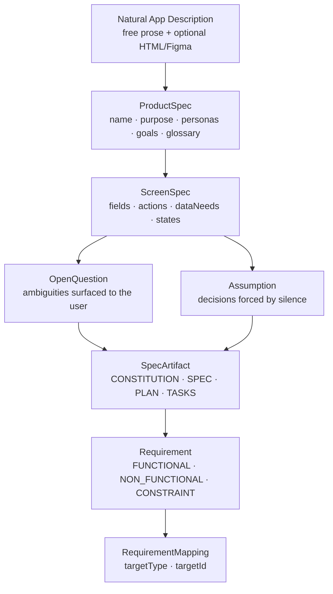

# 01 — Natural Spec Flow

Layers 0 to 5: from raw user description to structured Requirements.

This diagram covers the first half of the DTFS pipeline — the "understanding" phase where natural language is progressively structured into machine-readable spec artifacts.

## Agents impliqués

| Étape | Agent |
|-------|-------|
| ProductSpec | `dtfs-product-analyst` |
| ScreenSpec | `dtfs-screen-spec-writer` |
| Clarification | `dtfs-question-manager` |
| SpecArtifact | `dtfs-spec-writer` |
| Requirements | `dtfs-requirement-extractor` |

## Concepts liés

- [[EXECUTION_FLOW]] — Layers 0–5
- [[SPECKIT_INTEGRATION]] — SpecArtifact details
- [[01-control-plane-vs-client-runtime]] — où ces données sont stockées

> Status: stable
