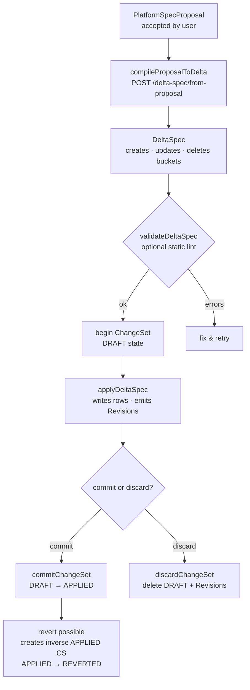

# 02 — Delta Spec Flow

Layers 6–8: from PlatformSpecProposal to committed (or reverted) ChangeSet.

This diagram covers the transactional write path into the Control Plane. Every mutation is grouped under a ChangeSet, ensuring full reversibility.

## Raccourci one-shot

`POST /api/projects/:id/delta-spec/apply` — ouvre, applique et commit en un seul appel.

## Ordre d'application des buckets

ProductSpecs → ScreenSpecs → Requirements → Entities → Attributes → Relations → Policies → Integrations → Operations → Resources → Triggers → Screens → Deletes

## Concepts liés

- [[CHANGESET_FLOW]] — documentation complète + exemples curl
- [[DELTA_SPEC]] — format DeltaSpec
- [[05-change-set-reversibility]] — schéma Excalidraw du lifecycle

> Status: stable
