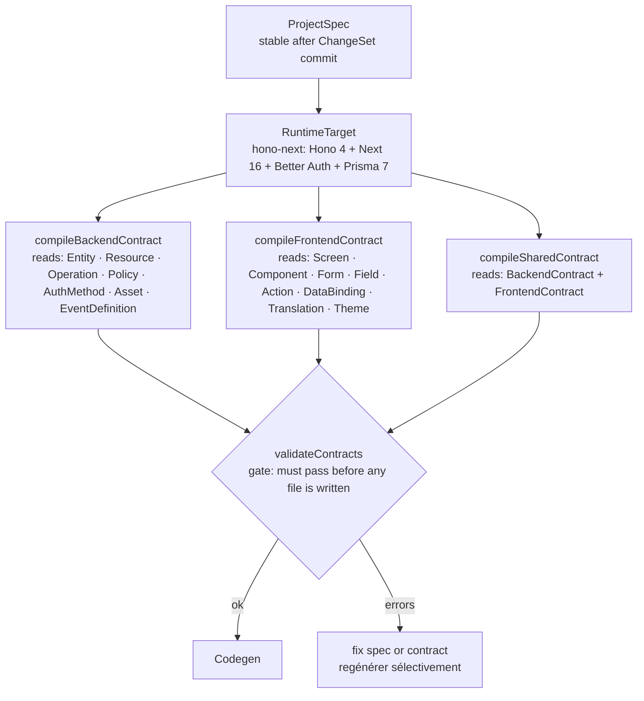

# 03 — Contract Compilation Flow

Layer 9a: from RuntimeTarget to validated contracts, the mandatory gate before any file is written.

This intermediate representation decouples the Control Plane (Entity, Operation, Screen…) from the code emitters. Changing framework (Hono → Fastify, Next → Remix) only requires a new emitter, not changes to the spec model.

## Résultat de la compilation

| Contract | Contenu |
|----------|---------|
| BackendContract | apiBasePath · routes[] · schemas[] · middlewares[] · auth · errors |
| FrontendContract | routes[] · pages[] · components[] · forms[] · dataBindings[] · actions[] · authGuards[] |
| SharedContract | types[] · schemas[] · apiClient[] · errors · events[] |

Chaque contract est une ligne DB (pas éphémère) — inspectable par les agents, diffable, régénérable sélectivement.

## Concepts liés

- [[RUNTIME_CONTRACTS_OVERVIEW]] — design doc complet
- [[BACKEND_CONTRACT]] — détail BackendContract
- [[FRONTEND_CONTRACT]] — détail FrontendContract
- [[SHARED_CONTRACT]] — détail SharedContract
- [[CONTRACT_VALIDATION]] — règles de validation
- [[CONTRACT_COMPILATION]] — implémentation

> Status: design-doc (Phase 25–26 target)
