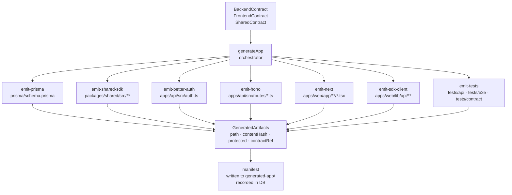

# 04 — Codegen Flow

Layer 9b: from validated contracts to GeneratedArtifacts on disk.

The emitters read contracts, never the Control Plane directly. This is the golden rule of codegen.

## Ordre recommandé

1. `prisma/schema.prisma`
2. `packages/shared/` (types + Zod schemas)
3. `apps/api/auth.ts` (Better Auth runtime)
4. `apps/api/routes/` (Hono backend)
5. `apps/web/` (Next 16 frontend)
6. `apps/web/lib/api/` (typed SDK client)
7. `tests/` (test scenarios from TestScenario rows)

## Concepts liés

- [[RUNTIME_CONTRACTS_OVERVIEW]] section 6 — architecture codegen
- [[GENERATED_ARTIFACTS]] — GeneratedArtifact model
- [[HONO_GENERATION]] — emit-hono détails
- [[NEXT16_GENERATION]] — emit-next détails
- [[BETTER_AUTH_GENERATION]] — emit-better-auth détails
- [[SDK_GENERATION]] — emit-sdk-client détails

> Status: design-doc (Phase 28 target)
