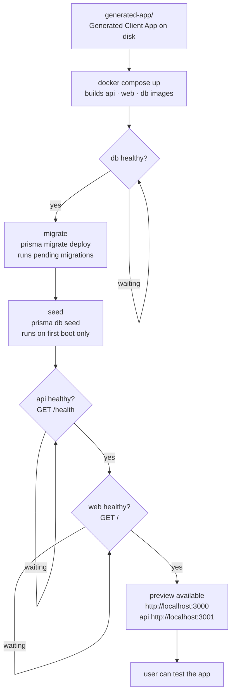

# 05 — Client Runtime Flow

Layer 10: from generated app to a running, healthy preview environment.

This diagram covers what happens after codegen — the deployment and startup sequence of the generated client app.

## Services docker-compose

| Service | Rôle |
|---------|------|
| `db` | Postgres 16, volume `client-db` |
| `migrate` | Init container — `prisma migrate deploy`, exit 0 |
| `seed` | Init container — `prisma db seed`, exit 0 |
| `api` | Hono 4 :3001, dépend de migrate + seed |
| `web` | Next 16 :3000, dépend de api healthy |

## Concepts liés

- [[CLIENT_APP_RUNTIME]] — architecture du runtime
- [[04-docker-runtime-client-app]] — schéma Excalidraw
- [[GENERATED_ARTIFACTS]] — artefacts écrits sur disque

> Status: cible (codegen pas encore implémenté)
