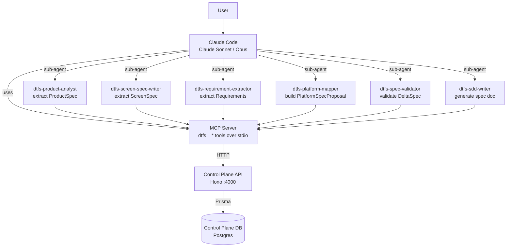

# 06 — MCP Agent Flow

How Claude Code and DTFS agents interact with the Control Plane via MCP tools.

The MCP server exposes `dtfs__*` tools over stdio. Claude Code calls them directly, and specialised sub-agents (`.claude/agents/dtfs-*`) orchestrate sequences of tool calls to implement multi-step workflows.

## Principaux outils MCP

| Outil | Description |
|-------|-------------|
| `dtfs__begin_changeset` | Ouvre un DRAFT ChangeSet |
| `dtfs__apply_delta_spec` | Applique un DeltaSpec dans un ChangeSet ouvert |
| `dtfs__commit_changeset` | Commit DRAFT → APPLIED |
| `dtfs__discard_changeset` | Supprime un DRAFT |
| `dtfs__revert_changeset` | Crée un ChangeSet inverse (revert) |
| `dtfs__list_history` | Liste les ChangeSets d'un projet |
| `dtfs__validate_delta_spec` | Lint statique sans écriture DB |
| `dtfs__get_spec_at` | Snapshot du spec à un ChangeSet donné |

## Concepts liés

- [[MCP_TOOLS]] — documentation complète des outils
- [[EXECUTION_FLOW]] — comment les agents orchestrent le pipeline
- [[01-control-plane-vs-client-runtime]] — périmètre du Control Plane

> Status: stable (outils existants) · design-doc (nouveaux outils Phase 26)
